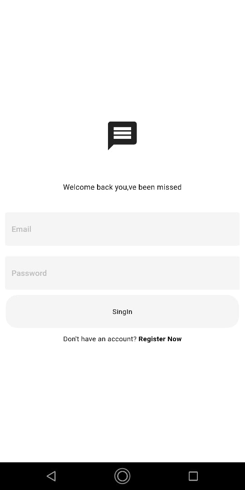
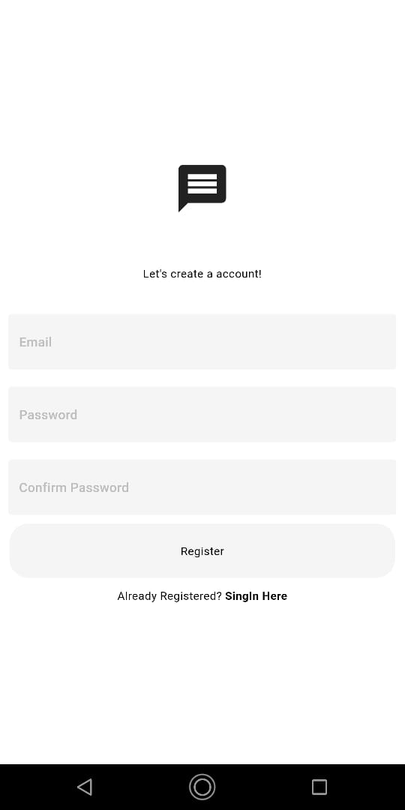
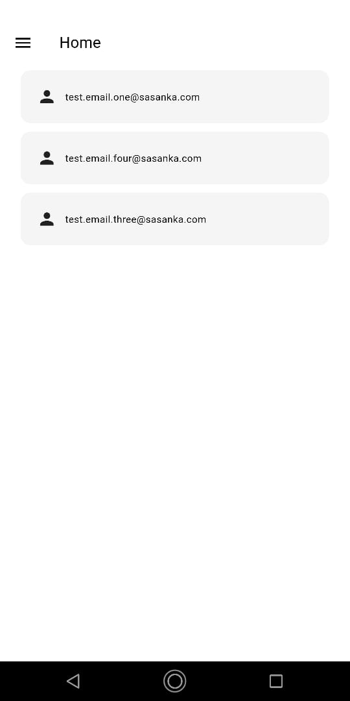
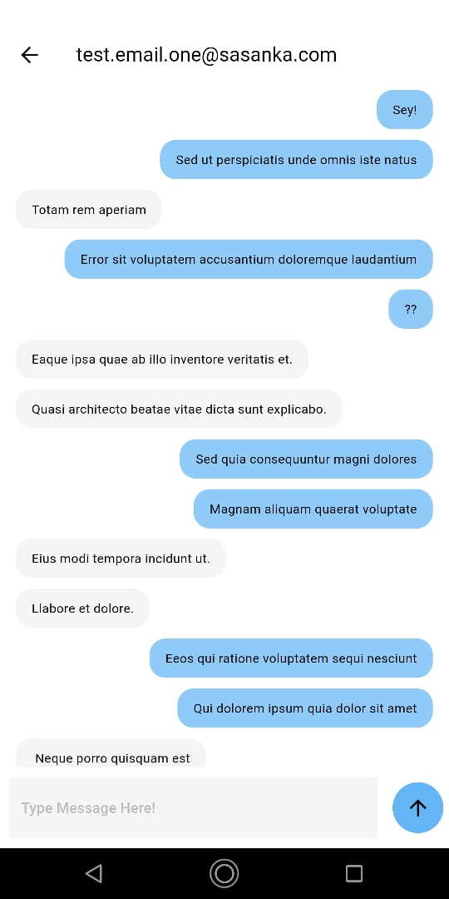

# Chat App

This is a real-time chat application built with Flutter and Firebase. It provides users with a simple and intuitive interface to connect with other users, send messages, and share their thoughts.

## Features
User Registration and Authentication: Users can easily create accounts using their email addresses and securely log in.
Messaging: Firebase Firestore Database ensures instant message delivery and a seamless chat experience.
User-Friendly UI: The app features a clean and modern design for an enjoyable chat experience.

## License
This project is licensed under the MIT License.

## Preview

### Login Page

### Register Page

### Home Page

### Chat Pages

### For more go to screenshots folder
Developed by Sasanka Dissanayake.
5/19/2024
